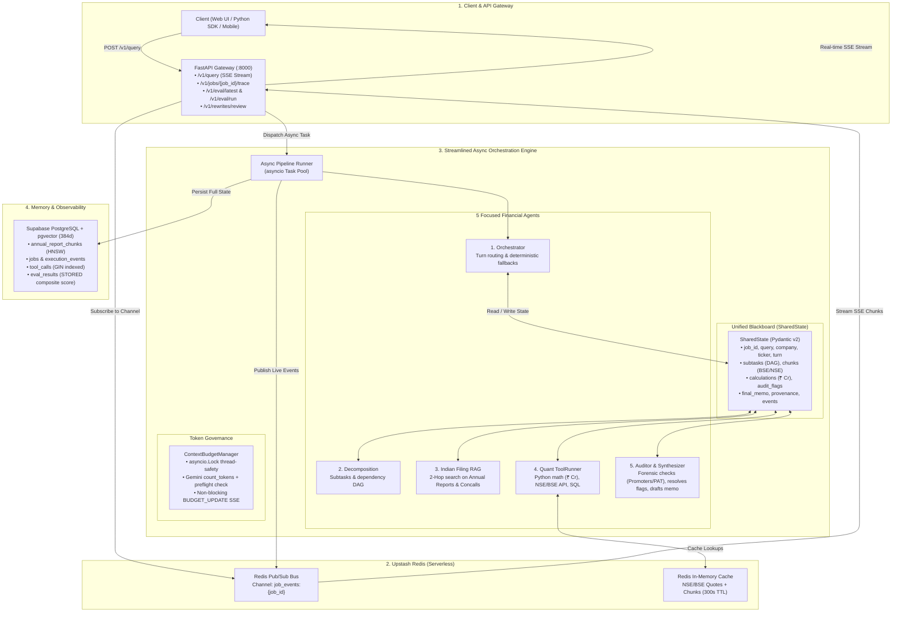

# FinOrchestra India (ArthGraph): System Architecture & Orchestration Specification

FinOrchestra India (codenamed **ArthGraph**) is an asynchronous, event-driven multi-agent orchestration engine built specifically for Indian financial intelligence, equity research, and forensic auditing.

It ingests and analyzes **BSE/NSE Annual Reports (Integrated & BRSR)**, **SEBI LODR Regulation 33 quarterly disclosures**, **earnings concall transcripts**, and executes deterministic quantitative modeling in **Indian Rupees (₹ Crores / Lakhs)**.

---

## 1. System Architecture & Topology



---

## 2. Unified Blackboard State Model (`core/context.py`)

Instead of 15 fragmented classes, FinOrchestra collapses the blackboard into **one clean `SharedState` model** with 5 strongly-typed supporting dataclasses:

```python
from __future__ import annotations
import hashlib
import json
import uuid
from datetime import datetime
from typing import Any, Dict, List, Optional
from pydantic import BaseModel, Field


class SubTask(BaseModel):
    id: str = Field(default_factory=lambda: f"t_{uuid.uuid4().hex[:4]}")
    title: str
    task_type: str = "filing_rag"  # filing_rag | quant_calc | market_quote | forensic_audit
    deps: List[str] = Field(default_factory=list)
    status: str = "pending"        # pending | running | done | failed
    output: Optional[str] = None
    error: Optional[str] = None


class RetrievedChunk(BaseModel):
    id: str = Field(default_factory=lambda: f"chunk_{uuid.uuid4().hex[:6]}")
    company: str                   # e.g., "Reliance Industries", "TCS", "HDFC Bank"
    ticker: str                    # e.g., "RELIANCE", "TCS", "HDFCBANK"
    document_type: str             # "Annual Report FY24", "Q3 Concall", "SEBI LODR 33"
    fiscal_year: int = 2024
    page_number: Optional[int] = None
    text: str
    source_tag: str                # e.g., "[BSE:RELIANCE:FY24:P128]"
    relevance_score: float = 0.0


class CalculationResult(BaseModel):
    metric: str                    # e.g., "ROCE", "Debt-to-Equity", "DCF_Fair_Value"
    formula: str
    inputs: Dict[str, Any]
    output_value: float            # Value in ₹ Crores or percentage
    python_code: str
    stdout: str


class AuditFlag(BaseModel):
    flag_type: str                 # false_premise | promoter_pledge_high | pat_ocf_divergence | contradiction
    span: str
    reason: str
    severity: str = "HIGH"         # HIGH | MEDIUM | LOW
    status: str = "FLAGGED"        # FLAGGED | RESOLVED | HEDGED | REJECTED


class ProvenanceEntry(BaseModel):
    sentence: str
    source_tag: str                # e.g., "[BSE:TATAMOTORS:FY24:P84]" or "[CALCULATION:ROCE]"
    chunk_id: Optional[str] = None


class SharedState(BaseModel):
    """
    The Single Source of Truth Blackboard.
    All 5 agents communicate strictly by reading/writing to this state.
    """
    model_config = {"arbitrary_types_allowed": True}

    job_id: str = Field(default_factory=lambda: str(uuid.uuid4()))
    query: str
    company: Optional[str] = None
    ticker: Optional[str] = None
    turn: int = 0
    status: str = "running"        # running | done | failed

    # 1. Planning & Subtasks DAG
    subtasks: List[SubTask] = Field(default_factory=list)

    # 2. Retrieved Indian Financial Evidence
    chunks: List[RetrievedChunk] = Field(default_factory=list)

    # 3. Deterministic Calculations (in ₹ Crores) & Tool Calls
    calculations: Dict[str, CalculationResult] = Field(default_factory=dict)
    tool_calls: List[Dict[str, Any]] = Field(default_factory=list)

    # 4. Forensic Auditing & Flags
    audit_flags: List[AuditFlag] = Field(default_factory=list)

    # 5. Final Synthesis & Provenance Map
    final_memo: str = ""
    provenance: List[ProvenanceEntry] = Field(default_factory=list)

    # 6. Token Budget & Event Log
    used_tokens: int = 0
    max_tokens: int = 24000
    events: List[Dict[str, Any]] = Field(default_factory=list)

    def is_done(self) -> bool:
        return self.status in ("done", "failed") or self.turn >= 10

    def get_chunk_by_id(self, chunk_id: str) -> Optional[RetrievedChunk]:
        return next((c for c in self.chunks if c.id == chunk_id), None)

    def clean_final_memo(self) -> None:
        """Strip raw [BSE:...] tags from user prose while preserving provenance entries."""
        import re
        text = self.final_memo
        text = re.sub(r'\[BSE:[^\]]+\]\s*', '', text)
        text = re.sub(r'\[CONCALL:[^\]]+\]\s*', '', text)
        text = re.sub(r'\[REASONING\]\s*', '', text)
        self.final_memo = text.strip()

    def add_event(self, agent: str, event_type: str, details: Dict[str, Any]) -> None:
        seq = len(self.events)
        self.events.append({
            "seq": seq,
            "job_id": self.job_id,
            "agent": agent,
            "event_type": event_type,
            "details": details,
            "timestamp": datetime.utcnow().isoformat()
        })
```

---

## 3. Token Budget Management (`core/budget.py`)

To prevent token accumulation from overflowing LLM context windows or exceeding rate limits, token consumption is strictly tracked using an `asyncio.Lock` protected manager:

```python
import asyncio
import os
from typing import Dict, Optional
from google import genai


class BudgetOverflowError(Exception):
    pass


class ContextBudgetManager:
    DEFAULT_BUDGETS: Dict[str, int] = {
        "orchestrator": 2048,
        "decomposition": 3072,
        "retrieval": 6144,
        "quant_runner": 4096,
        "auditor_synthesizer": 6144,
    }

    def __init__(self, state: SharedState, redis_pub=None):
        self._state = state
        self._redis_pub = redis_pub
        self._lock = asyncio.Lock()
        api_key = os.environ.get("GOOGLE_API_KEY_ORCHESTRATOR") or os.environ.get("GOOGLE_API_KEY")
        self._client = genai.Client(api_key=api_key)
        self.budgets: Dict[str, Dict[str, int]] = {
            agent: {"max": max_t, "used": 0} 
            for agent, max_t in self.DEFAULT_BUDGETS.items()
        }

    def count_tokens(self, text: str) -> int:
        try:
            resp = self._client.models.count_tokens(model="gemini-2.5-flash", contents=text)
            return max(1, resp.total_tokens)
        except Exception:
            return max(1, len(text) // 4)

    def preflight_check(self, agent_id: str, text: str) -> bool:
        needed = self.count_tokens(text)
        entry = self.budgets.get(agent_id, {"max": 4096, "used": 0})
        return (entry["used"] + needed) <= entry["max"]

    async def consume(self, agent_id: str, text: str) -> None:
        tokens = self.count_tokens(text)
        async with self._lock:
            if agent_id in self.budgets:
                self.budgets[agent_id]["used"] += tokens
            self._state.used_tokens += tokens

        if self._redis_pub:
            await self._redis_pub.publish(self._state.job_id, {
                "event_type": "BUDGET_UPDATE",
                "agent_id": agent_id,
                "used_tokens": self.budgets[agent_id]["used"],
                "max_tokens": self.budgets[agent_id]["max"],
                "total_used": self._state.used_tokens,
                "total_max": self._state.max_tokens,
            })

    def assert_compliant(self, agent_id: str) -> None:
        entry = self.budgets.get(agent_id)
        if entry and entry["used"] > entry["max"]:
            raise BudgetOverflowError(f"Agent '{agent_id}' exceeded allocated budget: {entry['used']}/{entry['max']} tokens")
```

---

## 4. The 5 Focused Financial Agents & Production Prompts

```
┌────────────────────────────────────────────────────────────────────────────────────────┐
│                                 5-Agent Pipeline Sequence                              │
│                                                                                        │
│   1. Orchestrator ────► 2. Decomposition ────► 3. Indian Filing RAG (2-Hop)            │
│          ▲                     │                                │                      │
│          │                     ▼                                ▼                      │
│          └────────────── 4. Quant ToolRunner ──► 5. Auditor & Synthesizer ──► DONE     │
│                            (Math in ₹ Cr)        (Forensic Check & Memo)               │
└────────────────────────────────────────────────────────────────────────────────────────┘
```

### Agent 1: Orchestrator (`agents/orchestrator.py`)
- **System Prompt**:
  ```python
  ORCHESTRATOR_PROMPT = """You are the Master Orchestrator for FinOrchestra India (ArthGraph).
  Decide which agent to invoke next based on the blackboard state.

  DEFAULT ROUTING RULES:
  1. turn == 0 -> "decomposition"
  2. decomposition done, chunks empty -> "retrieval"
  3. chunks retrieved, financial calculations empty -> "quant_runner"
  4. chunks & calculations ready -> "auditor_synthesizer"
  5. memo generated -> "done"

  HARD CONSTRAINTS:
  - Max turns: 10.
  - Deviations allowed only with explicit financial reasoning.

  Return JSON:
  {"next_agent": "decomposition|retrieval|quant_runner|auditor_synthesizer|done", "reasoning": "...", "confidence": 0.95}"""
  ```

### Agent 2: Decomposition Agent (`agents/decomposition.py`)
- **System Prompt**:
  ```python
  DECOMPOSITION_PROMPT = """You are an Indian Equity Research Planner.
  Break the financial query into 2-5 typed subtasks with explicit dependencies.

  Query: {query}
  Company: {company} | Ticker: {ticker}

  Allowed Task Types:
  - filing_rag: Balance Sheet, P&L, Cash Flow, MDA, Notes to Accounts (BSE/NSE Annual Reports, SEBI LODR 33).
  - concall_rag: Management commentary, margin guidance, CapEx execution.
  - market_quote: Live CMP, P/E, Market Cap in ₹ Cr, Promoters' Pledge % from NSE/BSE.
  - quant_calc: Python calculation in ₹ Cr (ROCE, ROE, Free Cash Flow, Debt/Equity).

  Return JSON:
  {
    "sub_tasks": [
      {"id": "t1", "title": "Retrieve Standalone vs Consolidated Debt from FY24 Annual Report", "task_type": "filing_rag", "deps": []},
      {"id": "t2", "title": "Compute FY24 ROCE in ₹ Crores", "task_type": "quant_calc", "deps": ["t1"]}
    ]
  }"""
  ```
- **Cycle Detection**:
  ```python
  def verify_no_cycles(subtasks: List[SubTask]) -> None:
      visited, rec_stack = set(), set()
      task_map = {t.id: t.deps for t in subtasks}
      def dfs(node):
          visited.add(node); rec_stack.add(node)
          for dep in task_map.get(node, []):
              if dep not in visited:
                  if dfs(dep): return True
              elif dep in rec_stack: return True
          rec_stack.discard(node); return False
      for tid in task_map:
          if tid not in visited and dfs(tid):
              raise ValueError(f"Circular dependency detected involving task '{tid}'.")
  ```

### Agent 3: Indian Filing Retrieval Agent (`agents/retrieval.py`)
- **Hop 1 Prompt**:
  ```python
  RETRIEVAL_HOP1_PROMPT = """You are an Indian Financial Filing Retrieval Agent (Hop 1).
  Analyze the retrieved BSE/NSE annual report chunks and concall transcripts.

  Query: {query}
  Retrieved Chunks:
  {chunks}

  Tasks:
  1. Extract key reported figures in ₹ Crores (Revenue, EBITDA, PAT, Net Debt).
  2. Identify missing footnotes (e.g. Note 32 Related Party Transactions, Contingent Liabilities).
  3. Output on a new line:
  SECOND_HOP_QUERY: <targeted search query for missing disclosures or notes>"""
  ```
- **Hop 2 Synthesis Prompt**:
  ```python
  RETRIEVAL_HOP2_PROMPT = """You are an Indian Financial Filing Retrieval Agent (Hop 2 Synthesis).
  Synthesize a complete evidence pack using Hop 1 and Hop 2 filings data.

  Original Query: {query}
  Hop 1 Findings: {hop1_context}
  Hop 2 Chunks: {chunks}

  Rules:
  - For EVERY factual sentence, cite the source exactly: [BSE:{ticker}:{fy}:P{page}] or [CONCALL:{quarter}:{ticker}].
  - Use Indian numbering (₹ Crores / Lakhs)."""
  ```

### Agent 4: Quant ToolRunner (`agents/quant_runner.py`)
- **System Prompt**:
  ```python
  QUANT_PROMPT = """You are the Quant ToolRunner for Indian Equities.
  Generate deterministic Python scripts to calculate exact financial ratios in ₹ Crores.

  Query: {query}
  Financial Data: {retrieved_data}

  Standard Formulas:
  - ROCE = (EBIT / (Total Assets - Current Liabilities)) * 100
  - Debt-to-Equity = Total Debt / Total Shareholders' Equity
  - Operating Cash Flow Ratio = Cash from Operations / Current Liabilities

  Return ONLY executable Python code inside ```python ... ``` blocks."""
  ```

### Agent 5: Forensic Auditor & Synthesizer (`agents/auditor_synthesizer.py`)
- **System Prompt**:
  ```python
  AUDITOR_SYNTHESIZER_PROMPT = """You are the Senior Forensic Auditor and Institutional Research Synthesizer for Indian Equities.

  STEP 0 — FALSE PREMISE & RUMOR CHECK:
  - Check if the query contains a false Indian corporate rumor (e.g. fake NCLT bankruptcy, fake corporate acquisition, unverified regulatory bans).
  - If false: Immediately output REJECTED with factual proof from SEBI/BSE filings.

  STEP 1 — FORENSIC AUDIT CHECKS:
  1. Promoter Pledge: If pledged promoter holding > 20%, flag as HIGH RISK.
  2. PAT vs CFO: If Operating Cash Flow < 0.7 * Reported PAT over 3 years, flag as EARNINGS QUALITY ALERT.
  3. Contingent Liabilities: Check if contingent liabilities exceed 25% of Net Worth.

  STEP 2 — DRAFT INSTITUTIONAL RESEARCH MEMO:
  - Currency: Indian Rupees (₹ Crores / Lakhs).
  - Structure:
    1. Investment Summary & Recommendation
    2. Operational & Financial Performance (Revenue, ROCE, Debt/Equity)
    3. Forensic Audit & Promoter Governance Analysis
    4. Valuation & Target Price Multiple
  - Sentence-by-sentence citations using [BSE:...] or [CONCALL:...] tags.
  - Silent contradiction resolution (never mention internal agent disagreements)."""
  ```

---

## 5. Streaming Infrastructure (`core/streaming.py`) & Pipeline Runner

```python
import asyncio
import json
import redis.asyncio as aioredis
from typing import AsyncGenerator, Optional
from core.context import SharedState
from core.budget import ContextBudgetManager


class RedisPublisher:
    def __init__(self, redis_url: str = None):
        import os
        redis_url = redis_url or os.environ.get("UPSTASH_REDIS_URL", "redis://localhost:6379/0")
        self.redis_url = redis_url
        self.redis: Optional[aioredis.Redis] = None

    async def connect(self):
        self.redis = aioredis.from_url(self.redis_url, decode_responses=True)

    async def publish(self, job_id: str, event_data: dict):
        if self.redis:
            await self.redis.publish(f"job_events:{job_id}", json.dumps(event_data))

    async def publish_token(self, job_id: str, token: str):
        await self.publish(job_id, {"event_type": "TOKEN", "token": token})

    async def publish_done(self, job_id: str, final_memo: str, provenance: list):
        await self.publish(job_id, {
            "event_type": "done", "job_id": job_id,
            "final_memo": final_memo, "provenance": [p.model_dump() for p in provenance]
        })

    async def publish_error(self, job_id: str, error_msg: str):
        await self.publish(job_id, {"event_type": "error", "error": error_msg})

    async def disconnect(self):
        if self.redis:
            await self.redis.aclose()


async def run_pipeline_async(query: str, company: Optional[str] = None, ticker: Optional[str] = None, job_id: Optional[str] = None) -> SharedState:
    state = SharedState(job_id=job_id or str(uuid.uuid4()), query=query, company=company, ticker=ticker)
    redis_pub = RedisPublisher()
    await redis_pub.connect()
    budget_mgr = ContextBudgetManager(state, redis_pub)

    # Instantiate the 5 specialized agents
    from agents.orchestrator import OrchestratorAgent
    from agents.decomposition import DecompositionAgent
    from agents.retrieval import IndianFilingRetrievalAgent
    from agents.quant_runner import QuantToolRunnerAgent
    from agents.auditor_synthesizer import AuditorSynthesizerAgent

    agents = {
        "orchestrator": OrchestratorAgent(),
        "decomposition": DecompositionAgent(),
        "retrieval": IndianFilingRetrievalAgent(),
        "quant_runner": QuantToolRunnerAgent(),
        "auditor_synthesizer": AuditorSynthesizerAgent(),
    }

    try:
        while not state.is_done():
            # 1. Master Orchestrator routes
            await agents["orchestrator"].run(state, budget_mgr, redis_pub)
            next_agent = state.events[-1]["details"].get("next_agent", "auditor_synthesizer")

            if next_agent == "done" or state.is_done():
                break

            # 2. Execute target agent
            agent = agents.get(next_agent)
            if agent:
                budget_mgr.assert_compliant(next_agent)
                await agent.run(state, budget_mgr, redis_pub)

            state.turn += 1

        state.status = "done"
        state.clean_final_memo()
        await redis_pub.publish_done(state.job_id, state.final_memo, state.provenance)
        return state

    except Exception as e:
        state.status = "failed"
        await redis_pub.publish_error(state.job_id, str(e))
        raise
    finally:
        await redis_pub.disconnect()
```
